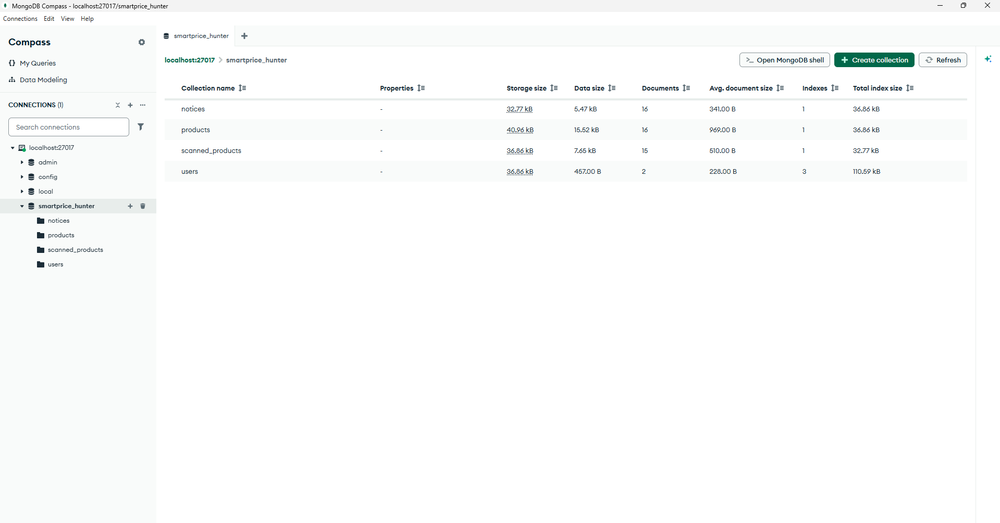

# SmartPrice Hunter

## 🛠️ Installazione

Per installare tutte le dipendenze bloccate nei file **package-lock.json**, eseguire il seguente comando prima in /backend (cartella del backend) e poi in /frontend (cartella del frontend), dentro il frontend richiederà un po di tempo in più. Questo comando installerà tutte le dipendenze contenute dentro i **package-lock.json**.

```bash
npm install
```

Poi è necessario aggiungere il file .env dentro /backend.

---

## 🚀 Avvio del Progetto

Il progetto è suddiviso in **Backend** e **Frontend**. È necessario avviarli entrambi aprendo dei terminali separati.

🟢 Terminale 1: Il Backend
Navigare nella cartella del backend e lanciare il server con questo comando:

``` bash
npm run dev
```

🔵 Terminale 2: Il Frontend
Navigare nella cartella frontend 


Avviare l'app in modalità sviluppo:


``` bash
ionic serve
```


(Attendi che l'app sia compilata e in ascolto sulla porta 8100).

🟣 Terminale 3: Il Tunnel Ngrok
Apri un terzo terminale (sempre dentro frontend) e genera il link HTTP pubblico:


``` bash
npx ngrok http 8100
```

📱 FASE 4: Test su Smartphone
Guarda l'output del Terminale 3 e copia l'URL generato alla riga Forwarding (es. https://abc-123.ngrok-free.app).

Prendi il tuo iPhone/Android, apri Safari/Chrome e digita quell'URL.

Se appare la schermata di benvenuto di Ngrok, clicca su "Visit Site".

## ⛃ Database

Per il Database è necessario aver installato MongoDB Compass (GUI) "https://www.mongodb.com/try/download/compass",

accedere alla GUI e aver creato un database chiamato "smartprice_hunter" per essere in linea con il file .env



---

Ho aggiunto una cartella barcode, per fare la prova della funzionalità di scansione dell'applicazione. All'interno ci sono sia i barcode da inserire manualmente per desktop, sia i barcode in png da scansionare con la fotocamera del telefono.